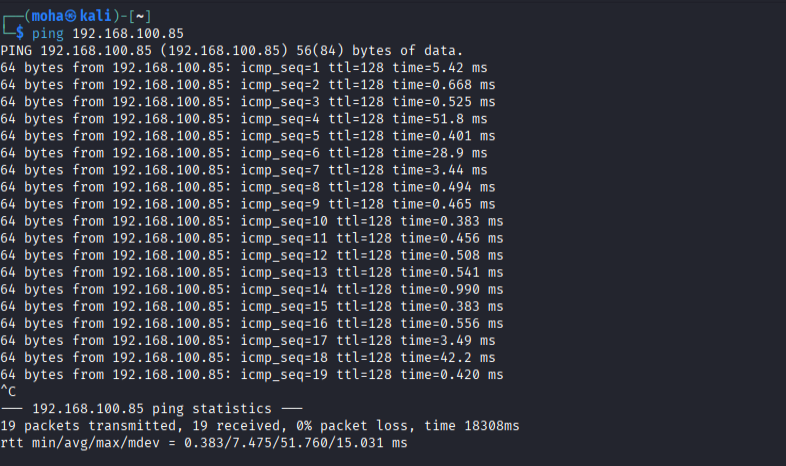
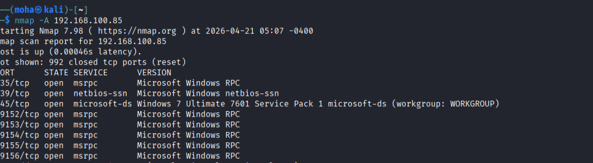
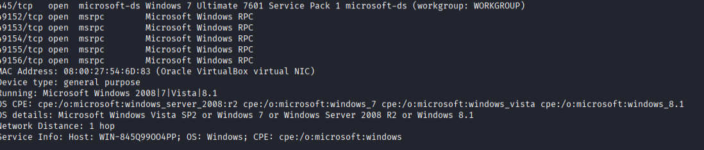
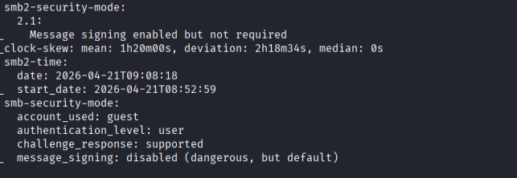
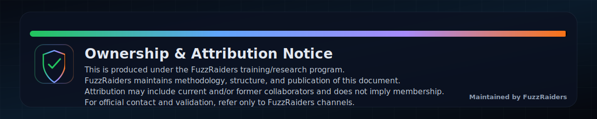

# 🔵 Blue Machine Write-Up

---

## 📌 Overview

This lab focuses on the enumeration phase of a Windows-based target machine in a VirtualBox environment. The objective was to verify connectivity and identify exposed services and system information through reconnaissance techniques.

---

## 🛠 Tools Used

- Nmap — service and OS enumeration  
- Ping (ICMP) — connectivity verification  

---

## 🎯 Target Information

| Field        | Value                         |
|-------------|------------------------------|
| Target IP    | 192.168.100.85              |
| Attacker     | Kali Linux                  |
| OS           | Windows 7 Ultimate SP1      |
| Hostname     | WIN-845Q99004PP            |
| Workgroup    | WORKGROUP                  |
| Goal         | Identify services and potential vulnerabilities |

---

## 🧭 Walkthrough

---

### Step 1 — Connectivity Check

```bash
ping 192.168.100.85
````

#### Evidence



#### 🧠 Analysis

* Host is alive
* Stable connection (0% packet loss)
* TTL = 128 → Windows system

---

### Step 2 — Service Discovery (Nmap)

```bash
nmap -A 192.168.100.85
```

#### Evidence



---

### Step 3 — System Identification



#### Description
This step focuses on identifying the target system’s operating system, hostname, and network characteristics using the results obtained from the Nmap scan.

From the scan output, the target was identified as **Windows 7 Ultimate 7601 Service Pack 1**, confirming that the system is running a legacy and unsupported operating system. The hostname was discovered as **WIN-845Q99004PP**, and the system is part of a **WORKGROUP**, indicating it is not domain-joined.

Additionally, the network distance was reported as **1 hop**, confirming that the target resides on the same local network as the attacker machine.

---

### Step 4 — SMB Analysis




#### Description
This step analyzes the Security Message Block (SMB) configuration identified during the Nmap scan. SMB is a critical service used for file sharing and remote communication in Windows environments, and misconfigurations can introduce significant security risks.

From the scan output, SMB-related scripts revealed that **message signing is enabled but not required**. This means that while the system supports SMB signing, it does not enforce it, allowing communication without integrity protection.

Additionally, the scan indicates that the **guest account is being used**, with an authentication level set to user. The configuration also shows that **message signing is effectively disabled (dangerous, but default)**.


#### 🧠 Analysis

* SMB exposed on port 445
* Signing not enforced → weak security
* Guest access allowed
* System configuration is insecure

---

### Step 5 — Vulnerability Identification

#### 🚨 Potential Vulnerability

**MS17-010 (EternalBlue)**


#### Reasoning

* Windows 7 SP1 detected ✔️
* SMB service exposed ✔️
* Weak SMB configuration ✔️

---

## 🔑 Key Findings

| Category       | Finding                         | Evidence Source | Risk Level |
| -------------- | ------------------------------- | --------------- | ---------- |
| Connectivity   | Host reachable (0% packet loss) | Ping output     | Low        |
| OS Detection   | Windows 7 Ultimate SP1          | Nmap scan       | High       |
| Port 135       | MSRPC service exposed           | Nmap scan       | Medium     |
| Port 139       | NetBIOS service exposed         | Nmap scan       | Medium     |
| Port 445       | SMB service exposed             | Nmap scan       | Critical   |
| RPC Ports      | Multiple dynamic RPC ports open | Nmap scan       | Medium     |
| SMB Config     | Message signing not enforced    | Nmap scan       | High       |
| Authentication | Guest-level access allowed      | Nmap scan       | High       |
| Vulnerability  | Likely vulnerable to MS17-010   | Analysis        | Critical   |

---

## 🎯 Result

* Target successfully identified
* Connectivity verified
* Services enumerated
* High-risk vulnerability identified

---

## ⚠️ Exploitation Status

Not performed

---

## 🛠 Remediation Recommendations

* Apply Microsoft patch MS17-010
* Disable SMBv1
* Enforce SMB signing
* Restrict port 445 access
* Upgrade legacy OS

---

## 📌 Conclusion

This lab demonstrated the effectiveness of enumeration techniques in identifying critical vulnerabilities. Using basic tools such as Nmap and ICMP testing, it was possible to gather sufficient information about the target system without performing exploitation.

The exposure of SMB services on port 445, combined with weak security configurations such as non-enforced message signing and guest-level authentication, created a significant attack surface. These findings strongly indicate that the system is vulnerable to MS17-010 (EternalBlue).

This exercise highlights the importance of proper system hardening, patch management, and restricting access to critical services in order to reduce security risks in real-world environments.

---
This work is part of FuzzRaiders’ structured hands-on training and research program, where every lab, project, and technical study is formally documented, reviewed, and validated to ensure real-world applicability, methodological rigor and real-world security execution

Happy hacking 🚀

---

